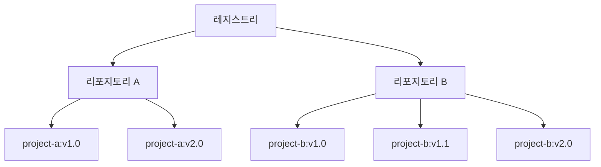

<YoutubeEmbed videoId="2WDl10Wv5rs" />

## 설명 {#explanation}

이제 컨테이너 이미지가 무엇인지 그리고 어떻게 작동하는지 알게 되었으니, 이 이미지를 어디에 저장할 수 있을지 궁금할 것입니다.

컨테이너 이미지를 컴퓨터 시스템에 저장할 수 있지만, 친구와 공유하거나 다른 기기에서 사용하려면 어떻게 해야 할까요? 이때 이미지 레지스트리가 필요합니다.

이미지 레지스트리는 컨테이너 이미지를 저장하고 공유하기 위한 중앙 저장소입니다. 이는 공개 또는 비공개일 수 있습니다. [Docker Hub](https://hub.docker.com)는 누구나 사용할 수 있는 공개 레지스트리이며 기본 레지스트리입니다.

Docker Hub는 인기 있는 옵션이지만, 오늘날 사용할 수 있는 다른 많은 컨테이너 레지스트리가 있습니다. 예를 들어 [Amazon Elastic Container Registry(ECR)](https://aws.amazon.com/ecr/), [Azure Container Registry (ACR)](https://azure.microsoft.com/en-in/products/container-registry), [Google Container Registry (GCR)](https://cloud.google.com/artifact-registry) 등이 있습니다. 또한, 로컬 시스템이나 조직 내에서 자체 레지스트리를 실행할 수도 있습니다. 예를 들어, Harbor, JFrog Artifactory, GitLab Container registry 등이 있습니다.

### 레지스트리 vs. 리포지토리 {#registry-vs-repository}

레지스트리를 사용하다 보면 _레지스트리_ 와 _리포지토리_ 라는 용어를 서로 바꿔서 사용하는 경우가 있습니다. 이 둘은 관련이 있지만, 완전히 동일한 것은 아닙니다.

_레지스트리_ 는 컨테이너 이미지를 저장하고 관리하는 중앙 집중식 위치인 반면, _리포지토리_ 는 레지스트리 내의 관련된 컨테이너 이미지 모음입니다. 프로젝트를 기준으로 이미지를 정리하는 폴더라고 생각하면 됩니다. 각 리포지토리에는 하나 이상의 컨테이너 이미지가 포함됩니다.

다음 다이어그램은 레지스트리, 리포지토리 및 이미지 간의 관계를 보여줍니다.



:::note
Docker Hub의 무료 버전을 사용하면 하나의 비공개 리포지토리와 무제한의 공개 리포지토리를 만들 수 있습니다. 자세한 내용은 [Docker Hub 구독 페이지](https://www.docker.com/pricing/)를 방문하세요.
:::

## 시도해보기 {#try-it-out}

이 실습에서는 Docker 이미지를 빌드하고 Docker Hub 리포지토리에 푸시하는 방법을 배웁니다.

### 무료 Docker 계정 가입 {#sign-up-for-a-free-docker-account}

1. 아직 계정을 만들지 않았다면, [Docker Hub](https://hub.docker.com) 페이지로 이동하여 새 Docker 계정을 등록하세요.

   

   Google 또는 GitHub 계정을 사용하여 인증할 수 있습니다.

### 첫 번째 리포지토리 만들기 {#create-your-first-repository}

1. [Docker Hub](https://hub.docker.com)에 로그인합니다.
2. 오른쪽 상단의 **Create repository** 버튼을 선택합니다.
3. 네임스페이스(대부분의 경우 사용자 이름)를 선택하고 리포지토리 이름으로 `docker-quickstart`를 입력합니다.

   

4. 가시성을 **Public**으로 설정합니다.
5. **Create** 버튼을 선택하여 리포지토리를 만듭니다.

이제 첫 번째 리포지토리를 성공적으로 만들었습니다. 🎉

이 리포지토리는 현재 비어 있습니다. 이제 이미지를 푸시하여 이를 수정할 것입니다.

### Docker Desktop으로 로그인 {#sign-in-with-docker-desktop}

1. [Docker Desktop 다운로드 및 설치](https://www.docker.com/products/docker-desktop/)가 아직 설치되지 않은 경우 설치합니다.
2. Docker Desktop GUI에서 오른쪽 상단의 **Sign in** 버튼을 선택합니다.

### 샘플 Node.js 코드 클론 {#clone-sample-nodejs-code}

이미지를 만들려면 먼저 프로젝트가 필요합니다. 빠르게 시작할 수 있도록 [github.com/dockersamples/helloworld-demo-node](https://github.com/dockersamples/helloworld-demo-node)에서 샘플 Node.js 프로젝트를 사용할 것입니다. 이 리포지토리에는 Docker 이미지를 빌드하는 데 필요한 사전 빌드된 Dockerfile이 포함되어 있습니다.

Dockerfile의 세부 사항에 대해 걱정하지 마세요. 나중에 섹션에서 이에 대해 배울 것입니다.

1. 다음 명령을 사용하여 GitHub 리포지토리를 클론합니다:

   ```bash
   git clone https://github.com/dockersamples/helloworld-demo-node
   ```

2. 새로 생성된 디렉토리로 이동합니다.

   ```bash
   cd helloworld-demo-node
   ```

3. 다음 명령을 실행하여 Docker 이미지를 빌드합니다. `YOUR_DOCKER_USERNAME`을 사용자 이름으로 바꿉니다.

   ```bash
   docker build -t <YOUR_DOCKER_USERNAME>/docker-quickstart .
   ```

   :::note
   `docker build` 명령의 끝에 점(.)을 포함해야 합니다. 이는 Docker가 Dockerfile을 찾을 위치를 알려줍니다.
   :::

4. 다음 명령을 실행하여 새로 생성된 Docker 이미지를 나열합니다:

   ```bash
   docker images
   ```

   다음과 같은 출력이 표시됩니다:

   ```bash
   REPOSITORY                                 TAG       IMAGE ID       CREATED         SIZE
   <YOUR_DOCKER_USERNAME>/docker-quickstart   latest    476de364f70e   2 minutes ago   170MB
   ```

5. 다음 명령을 실행하여 이미지를 테스트하기 위해 컨테이너를 시작합니다(사용자 이름을 자신의 사용자 이름으로 바꿉니다):

   ```bash
   docker run -d -p 8080:8080 <YOUR_DOCKER_USERNAME>/docker-quickstart
   ```

   브라우저에서 [http://localhost:8080](http://localhost:8080)에 방문하여 컨테이너가 작동하는지 확인할 수 있습니다.

6. [`docker tag`](/reference/cli/docker/image/tag/) 명령을 사용하여 Docker 이미지를 태그합니다. Docker 태그를 사용하면 이미지를 라벨링하고 버전 관리할 수 있습니다.

   ```bash
   docker tag <YOUR_DOCKER_USERNAME>/docker-quickstart <YOUR_DOCKER_USERNAME>/docker-quickstart:1.0
   ```

7. 마지막으로, [`docker push`](/reference/cli/docker/image/push/) 명령을 사용하여 새로 빌드된 이미지를 Docker Hub 리포지토리에 푸시합니다:

   ```bash
   docker push <YOUR_DOCKER_USERNAME>/docker-quickstart:1.0
   ```

8. [Docker Hub](https://hub.docker.com)를 열고 리포지토리로 이동합니다. **Tags** 섹션으로 이동하여 새로 푸시된 이미지를 확인합니다.

   

이번 학습에서는 Docker 계정에 가입하고, 첫 번째 Docker Hub 리포지토리를 만들고, 컨테이너 이미지를 빌드, 태그 및 Docker Hub 리포지토리에 푸시했습니다.

## 추가 자료 {#additional-resources}

- [Docker Hub 빠른 시작](/docker-hub/quickstart/)
- [Docker Hub 리포지토리 관리](/docker-hub/repos/)

## 다음 단계 {#next-steps}

이제 컨테이너와 이미지의 기본 사항을 이해했으므로 Docker Compose에 대해 배울 준비가 되었습니다.

<Button href="what-is-Docker-Compose">Docker Compose란 무엇인가?</Button>
