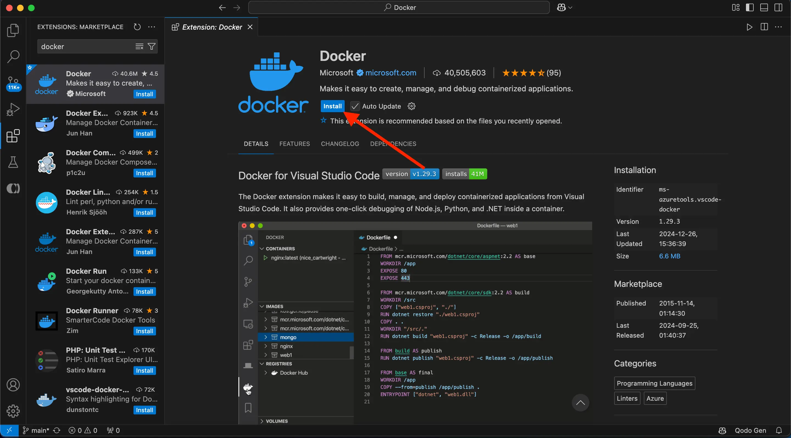
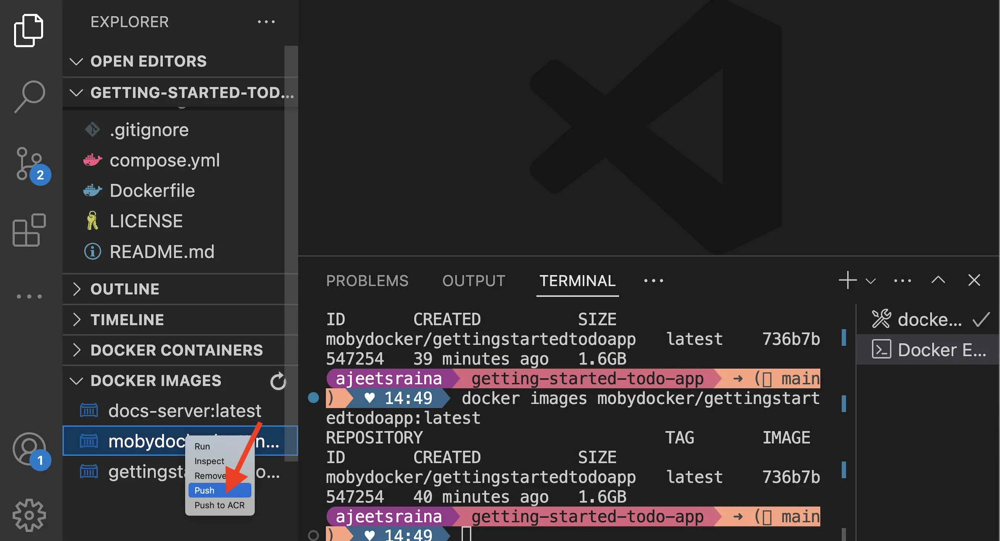

<YoutubeEmbed videoId="7ge1s5nAa34" />

## 설명 {#explanation}

이제 [to-do list 앱](develop-with-containers.md)을 업데이트했으므로, 애플리케이션을 위한 컨테이너 이미지를 만들고 Docker Hub에 공유할 준비가 되었습니다. 이를 위해 다음을 수행해야 합니다:

1. Docker 계정으로 로그인하기
2. Docker Hub에서 이미지 저장소 생성하기
3. 컨테이너 이미지 빌드하기
4. 이미지를 Docker Hub에 푸시하기

실습 가이드를 시작하기 전에 알아두어야 할 몇 가지 핵심 개념이 있습니다.

### 컨테이너 이미지 {#container-images}

컨테이너 이미지가 처음이라면, 애플리케이션을 실행하는 데 필요한 모든 파일, 구성 및 종속성을 포함하는 표준화된 패키지로 생각하십시오. 이러한 패키지는 다른 사람들과 공유할 수 있습니다.

### Docker Hub {#docker-hub}

Docker 이미지를 공유하려면 저장할 장소가 필요합니다. 여기서 레지스트리가 필요합니다. 많은 레지스트리가 있지만, Docker Hub는 기본 및 가장 많이 사용되는 이미지 레지스트리입니다. Docker Hub는 자신의 이미지를 저장할 장소와 다른 사람들의 이미지를 찾아 실행하거나 자신의 이미지의 기반으로 사용할 수 있는 장소를 제공합니다.

[컨테이너로 개발하기](develop-with-containers.md)에서 다음 이미지를 사용했습니다. 이 이미지는 모두 [Docker 공식 이미지](/manuals/docker-hub/image-library/trusted-content.md#docker-official-images)입니다:

- [node](https://hub.docker.com/_/node) - Node 환경을 제공하며 개발 작업의 기반으로 사용됩니다. 이 이미지는 최종 애플리케이션 이미지의 기반으로도 사용됩니다.
- [mysql](https://hub.docker.com/_/mysql) - to-do list 항목을 저장하는 MySQL 데이터베이스를 제공합니다.
- [phpmyadmin](https://hub.docker.com/_/phpmyadmin) - MySQL 데이터베이스에 대한 웹 기반 인터페이스인 phpMyAdmin을 제공합니다.
- [traefik](https://hub.docker.com/_/traefik) - 요청을 라우팅 규칙에 따라 적절한 컨테이너로 라우팅하는 최신 HTTP 리버스 프록시 및 로드 밸런서를 제공합니다.

전체 [Docker 공식 이미지](https://hub.docker.com/search?image_filter=official&q=), [Docker 인증 게시자](https://hub.docker.com/search?q=&image_filter=store), 및 [Docker 후원 오픈 소스 소프트웨어](https://hub.docker.com/search?q=&image_filter=open_source) 이미지들을 둘러보며 다양한 활용 방법을 확인해보세요.

## 시도해보기 {#try-it-out}

이 실습 가이드에서는 Docker Hub에 로그인하고 이미지를 Docker Hub 저장소에 푸시하는 방법을 배웁니다.

## Docker 계정으로 로그인하기 {#sign-in-with-your-docker-account}

이미지를 Docker Hub에 푸시하려면 Docker 계정으로 로그인해야 합니다.

1. Docker 대시보드를 엽니다.

2. 오른쪽 상단의 **Sign in**을 선택합니다.

3. 필요하다면 계정을 생성한 후 로그인 절차를 완료합니다.

로그인이 완료되면 **Sign in** 버튼이 프로필 사진으로 바뀌는 것을 볼 수 있습니다.

## 이미지 저장소 생성하기 {#create-an-image-repository}

이제 계정이 있으므로 이미지 저장소를 생성할 수 있습니다. Git 저장소가 소스 코드를 저장하는 것처럼, 이미지 저장소는 컨테이너 이미지를 저장합니다.

1. [Docker Hub](https://hub.docker.com)로 이동합니다.

2. **Create repository**을 선택합니다.

3. **Create repository** 페이지에서 다음 정보를 입력합니다:

   - **Repository name** - `getting-started-todo-app`
   - **Short description** - 원하시면 설명을 입력하십시오.
   - **Visibility** - 다른 사람들이 사용자 정의한 to-do 앱을 가져갈 수 있도록 **Public**를 선택합니다.

4. **Create**을 선택하여 저장소를 생성합니다.

## 이미지 빌드 및 푸시하기 {#build-and-push-the-image}

이제 저장소가 있으므로 이미지를 빌드하고 푸시할 준비가 되었습니다. 중요한 점은 빌드하는 이미지가 Node 이미지를 확장한다는 것입니다. 즉, Node, yarn 등을 설치하거나 구성할 필요가 없으며 애플리케이션의 고유한 부분에 집중할 수 있습니다.

> **이미지/Dockerfile이란?**
>
> 깊이 들어가지 않고, 컨테이너 이미지를 프로세스를 실행하는 데 필요한 모든 것을 포함하는 단일 패키지로 생각하십시오.
> 이 경우, Node 환경, 백엔드 코드 및 컴파일된 React 코드를 포함합니다.
>
> 이미지를 사용하는 컨테이너를 실행하는 모든 머신은 사전에 아무것도 설치할 필요 없이 애플리케이션을 실행할 수 있습니다.
>
> `Dockerfile`은 이미지를 빌드하는 방법에 대한 명령어 세트를 제공하는 텍스트 기반 스크립트입니다. 이 빠른 시작을 위해 저장소에는 이미 Dockerfile이 포함되어 있습니다.

<Tabs>
<TabItem value="cli" label="CLI">

1. 시작하려면 프로젝트를 로컬 머신에 클론하거나 [ZIP 파일로 다운로드](https://github.com/docker/getting-started-todo-app/archive/refs/heads/main.zip)합니다.

   ```bash
   $ git clone https://github.com/docker/getting-started-todo-app
   ```

   프로젝트가 클론된 후, 클론으로 생성된 새 디렉토리로 이동합니다:

   ```bash
   $ cd getting-started-todo-app
   ```

2. 다음 명령어를 실행하여 프로젝트를 빌드합니다. `DOCKER_USERNAME`을 사용자 이름으로 바꿉니다.

   ```bash
   $ docker build -t <DOCKER_USERNAME>/getting-started-todo-app .
   ```

   예를 들어, Docker 사용자 이름이 `mobydock`이라면 다음 명령어를 실행합니다:

   ```bash
   $ docker build -t mobydock/getting-started-todo-app .
   ```

3. 이미지가 로컬에 존재하는지 확인하려면 `docker image ls` 명령어를 사용할 수 있습니다:

   ```bash
   $ docker image ls
   ```

   다음과 유사한 출력이 표시됩니다:

   ```bash
   REPOSITORY                          TAG       IMAGE ID       CREATED          SIZE
   mobydock/getting-started-todo-app   latest    1543656c9290   2 minutes ago    1.12GB
   ...
   ```

4. 이미지를 푸시하려면 `docker push` 명령어를 사용합니다. `DOCKER_USERNAME`을 사용자 이름으로 바꿉니다:

   ```bash
   $ docker push <DOCKER_USERNAME>/getting-started-todo-app
   ```

   업로드 속도에 따라 푸시하는 데 시간이 걸릴 수 있습니다.

</TabItem>
<TabItem value="vscode" label="VS Code">

1. Visual Studio Code를 실행합니다. [확장 마켓플레이스](https://marketplace.visualstudio.com/items?itemName=ms-azuretools.vscode-docker)에서 **Docker extension for VS Code**가 설치되어 있는지 확인하세요.

   

1. Visual Studio Code를 엽니다. **File** 메뉴에서 **Open Folder**를 선택합니다. **Clone Git Repository**을 선택하고 이 URL을 붙여넣습니다: [https://github.com/docker/getting-started-todo-app](https://github.com/docker/getting-started-todo-app)

   

1. `Dockerfile`을 마우스 오른쪽 버튼으로 클릭하고 **Build Image...** 메뉴 항목을 선택합니다.

   

1. 나타나는 대화 상자에서 `DOCKER_USERNAME/getting-started-todo-app`이라는 이름을 입력합니다. `DOCKER_USERNAME`을 Docker 사용자 이름으로 바꿉니다.

1. **Enter**를 누르면 빌드가 진행될 터미널이 나타납니다. 완료되면 터미널을 닫아도 됩니다.

1. 왼쪽 탐색 메뉴에서 Docker 로고를 선택하여 VS Code의 Docker 확장을 엽니다.

1. 생성한 이미지를 찾습니다. `docker.io/DOCKER_USERNAME/getting-started-todo-app`이라는 이름을 가집니다.

1. 이미지를 확장하여 이미지의 태그(또는 다른 버전)를 봅니다. 기본적으로 `latest`라는 태그가 표시됩니다.

1. **latest** 항목을 마우스 오른쪽 버튼으로 클릭하고 **Push...** 옵션을 선택합니다.

   

1. **Enter**를 눌러 확인한 후 이미지를 Docker Hub에 푸시하는 과정을 지켜봅니다. 업로드 속도에 따라 푸시하는 데 시간이 걸릴 수 있습니다.

   업로드가 완료되면 터미널을 닫아도 됩니다.

</TabItem>
</Tabs>

## 요약 {#recap}

다음으로 넘어가기 전에 여기서 일어난 일을 잠시 되돌아보세요. 몇 분 안에 애플리케이션을 패키징하는 컨테이너 이미지를 빌드하고 Docker Hub에 푸시할 수 있었습니다.

앞으로 기억해야 할 사항은 다음과 같습니다:

- Docker Hub는 신뢰할 수 있는 콘텐츠를 찾기 위한 기본 레지스트리입니다. Docker는 Docker 공식 이미지, Docker 인증 게시자 및 Docker 후원 오픈 소스 소프트웨어로 구성된 신뢰할 수 있는 콘텐츠 컬렉션을 제공하여 직접 사용하거나 자신의 이미지의 기반으로 사용할 수 있습니다.

- Docker Hub는 자신의 애플리케이션을 배포할 수 있는 마켓플레이스를 제공합니다. 누구나 계정을 생성하고 이미지를 배포할 수 있습니다. 생성한 이미지를 공개적으로 배포하는 동안, 비공개 저장소는 이미지가 권한이 있는 사용자에게만 접근 가능하도록 할 수 있습니다.

> **다른 레지스트리 사용**
>
> Docker Hub는 기본 레지스트리이지만, 레지스트리는 [Open Container Initiative](https://opencontainers.org/)를 통해 표준화되고 상호 운용 가능합니다. 이를 통해 기업과 조직은 자체 비공개 레지스트리를 운영할 수 있습니다. 종종 신뢰할 수 있는 콘텐츠는 Docker Hub에서 이러한 비공개 레지스트리로 미러링(또는 복사)됩니다.

## 다음 단계 {#next-steps}

이제 이미지를 빌드했으므로, 개발자로서 Docker를 더 많이 배워야 하는 이유와 일상 작업에서 Docker가 어떻게 도움이 되는지 논의할 시간입니다.

<Button href="whats-next">다음 단계</Button>
