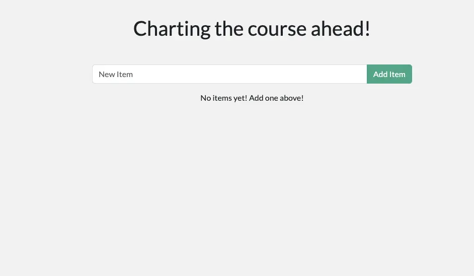

<YoutubeEmbed videoId="D0SDBrS3t9I" />

## 컨테이너로 개발하기 {#develop-with-containers}

이제 Docker Desktop을 설치했으니 애플리케이션 개발을 시작할 준비가 되었습니다. 구체적으로 다음을 수행합니다:

1. 개발 프로젝트를 클론하고 시작하기
2. 백엔드 및 프론트엔드 변경하기
3. 변경 사항을 즉시 확인하기

## 시도해보기 {#try-it-out}

이 실습 가이드에서는 컨테이너로 개발하는 방법을 배웁니다.

## 프로젝트 시작하기 {#start-the-project}

1. 시작하려면 프로젝트를 클론하거나 [ZIP 파일로 다운로드](https://github.com/docker/getting-started-todo-app/archive/refs/heads/main.zip)하여 로컬 머신에 저장합니다.

   ```bash
   $ git clone https://github.com/docker/getting-started-todo-app
   ```

   프로젝트를 클론한 후, 클론으로 생성된 새 디렉토리로 이동합니다:

   ```bash
   $ cd getting-started-todo-app
   ```

2. 프로젝트를 얻은 후, Docker Compose를 사용하여 개발 환경을 시작합니다.

   CLI를 사용하여 프로젝트를 시작하려면 다음 명령어를 실행합니다:

   ```bash
   $ docker compose watch
   ```

   컨테이너 이미지가 다운로드되고, 컨테이너가 시작되는 등의 출력을 볼 수 있습니다. 이 시점에서 모든 것을 이해하지 못해도 걱정하지 마세요. 몇 분 내에 안정화되고 완료될 것입니다.

3. 브라우저를 열고 [http://localhost](http://localhost)에서 애플리케이션이 실행 중인지 확인합니다. 애플리케이션이 실행되는 데 몇 분이 걸릴 수 있습니다. 애플리케이션은 간단한 할 일 목록 애플리케이션이므로 항목을 추가하거나 완료로 표시하거나 항목을 삭제해보세요.

   

### 환경에 무엇이 있나요? {#whats-in-the-environment}

이제 환경이 실행 중인데, 실제로 무엇이 들어있을까요? 고레벨에서 애플리케이션에 특정 필요를 제공하는 여러 컨테이너(또는 프로세스)가 있습니다:

- React 프론트엔드 - [Vite](https://vitejs.dev/)를 사용하는 React 개발 서버를 실행하는 Node 컨테이너입니다.
- Node 백엔드 - 백엔드는 할 일 항목을 검색, 생성 및 삭제할 수 있는 API를 제공합니다.
- MySQL 데이터베이스 - 항목 목록을 저장하는 데이터베이스입니다.
- phpMyAdmin - 데이터베이스와 상호작용할 수 있는 웹 기반 인터페이스로, [http://db.localhost](http://db.localhost)에서 접근할 수 있습니다.
- Traefik 프록시 - [Traefik](https://traefik.io/traefik/)은 요청을 올바른 서비스로 라우팅하는 애플리케이션 프록시입니다. `localhost/api/*`에 대한 모든 요청을 백엔드로, `localhost/*`에 대한 요청을 프론트엔드로, `db.localhost`에 대한 요청을 phpMyAdmin으로 보냅니다. 이를 통해 각 서비스에 대해 다른 포트를 사용하는 대신 포트 80을 사용하여 모든 애플리케이션에 접근할 수 있습니다.

이 환경을 통해 개발자는 서비스를 설치하거나 구성할 필요가 없으며, 데이터베이스 스키마를 채우거나 데이터베이스 자격 증명을 구성할 필요도 없습니다. Docker Desktop만 있으면 됩니다. 나머지는 자동으로 작동합니다.

## 애플리케이션 수정하기 {#make-changes-to-the-app}

이 환경이 실행 중인 상태에서 애플리케이션에 몇 가지 변경을 하고 Docker를 통해 변경사항을 빠르게 확인하는 방법을 알아보겠습니다

### 인사말 수정하기 {#change-the-greeting}

페이지 상단의 인사말은 `/api/greeting`에서 API 호출로 채워집니다. 현재는 항상 "Hello world!"를 반환합니다. 이제 세 가지 무작위 메시지 중 하나를 반환하도록 수정합니다(직접 선택할 수 있습니다).

1. 텍스트 편집기에서 `backend/src/routes/getGreeting.js` 파일을 엽니다. 이 파일은 API 엔드포인트에 대한 핸들러를 제공합니다.

2. 상단의 변수를 인사말 배열로 수정합니다. 다음 수정 사항을 사용하거나 원하는 대로 사용자 정의할 수 있습니다. 또한, 이 목록에서 무작위 인사말을 보내도록 엔드포인트를 업데이트합니다.

   ```js
   const GREETINGS = [
     "Whalecome!",
     "All hands on deck!",
     "Charting the course ahead!",
   ];

   module.exports = async (req, res) => {
     res.send({
       greeting: GREETINGS[Math.floor(Math.random() * GREETINGS.length)],
     });
   };
   ```

3. 파일을 저장하지 않았다면 저장합니다. 브라우저를 새로 고치면 새로운 인사말을 볼 수 있습니다. 계속 새로 고치면 모든 메시지가 나타나는 것을 볼 수 있습니다.

   

### 플레이스홀더 텍스트 변경하기 {#change-the-placeholder-text}

애플리케이션을 보면 플레이스홀더 텍스트가 단순히 "New Item"입니다. 이를 좀 더 설명적이고 재미있게 만듭니다. 또한 애플리케이션의 스타일링도 몇 가지 변경합니다.

1. `client/src/components/AddNewItemForm.jsx` 파일을 엽니다. 이 파일은 할 일 목록에 새 항목을 추가하는 컴포넌트를 제공합니다.

2. `Form.Control` 요소의 `placeholder` 속성을 원하는 텍스트로 수정합니다.

   ```js
   <Form.Control
     value={newItem}
     onChange={(e) => setNewItem(e.target.value)}
     type="text"
     placeholder="What do you need to do?"
     aria-label="New item"
   />
   ```

3. 파일을 저장하고 브라우저로 돌아갑니다. 변경 사항이 이미 브라우저에 핫 리로드된 것을 볼 수 있습니다. 마음에 들지 않으면 원하는 대로 조정할 수 있습니다.


### 배경색 변경하기 {#change-the-background-color}

애플리케이션을 최종화하기 전에 색상을 더 좋게 만들어야 합니다.

1. `client/src/index.scss` 파일을 엽니다.

2. 원하는 색상으로 `background-color` 속성을 조정합니다. 제공된 스니펫은 Docker의 해양 테마에 맞는 부드러운 파란색입니다.

   IDE를 사용하는 경우 통합 색상 선택기를 사용하여 색상을 선택할 수 있습니다. 그렇지 않으면 온라인 [Color Picker](https://www.w3schools.com/colors/colors_picker.asp)를 사용해도 됩니다.

   ```css
   body {
     background-color: #99bbff;
     margin-top: 50px;
     font-family: "Lato";
   }
   ```

   각 저장은 브라우저에서 즉시 변경 사항을 확인할 수 있게 합니다. 완벽한 설정이 될 때까지 계속 조정합니다.

   

이로써 완료되었습니다. 웹사이트 업데이트를 축하합니다.

## 요약 {#recap}

다음 단계로 넘어가기 전에, 지금까지 진행한 내용을 잠시 살펴보겠습니다. 짧은 시간 안에 우리는 다음과 같은 작업들을 완료했습니다:

- 설치 노력이 전혀 없이 완전한 개발 프로젝트를 시작했습니다. 컨테이너화된 환경은 개발 환경을 제공하여 필요한 모든 것을 갖추고 있습니다. Node, MySQL 또는 기타 종속성을 직접 설치할 필요가 없었습니다. Docker Desktop과 코드 편집기만 있으면 됩니다.

- 변경 사항을 즉시 확인했습니다. 이는 1) 각 컨테이너에서 실행 중인 프로세스가 파일 변경을 감지하고 응답하며 2) 파일이 컨테이너화된 환경과 공유되기 때문에 가능합니다.

Docker Desktop은 이 모든 것과 더 많은 것을 가능하게 합니다. 컨테이너를 사용하여 생각하기 시작하면 거의 모든 환경을 만들고 팀과 쉽게 공유할 수 있습니다.

## 다음 단계 {#next-steps}

이제 애플리케이션이 업데이트되었으므로 컨테이너 이미지로 패키징하고 레지스트리, 특히 Docker Hub에 푸시하는 방법을 배울 준비가 되었습니다.

<Button href="build-and-push-first-image">첫 번째 이미지 빌드 및 푸시하기</Button>
