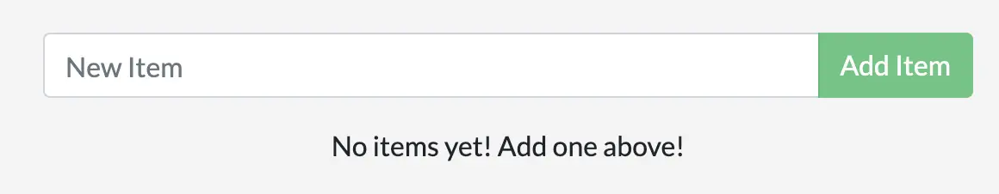

이 가이드의 나머지 부분에서는 Node.js에서 실행되는 간단한 todo 애플리케이션을 다룰 예정입니다. Node.js에 익숙하지 않으셔도 걱정하지 마세요. 이 가이드는 JavaScript 사전 경험이 필요하지 않습니다.

## 전제 조건 {#prerequisites}

- 최신 버전의 [Docker Desktop](/get-started/get-docker.md)을 설치했습니다.
- [Git 클라이언트](https://git-scm.com/downloads)를 설치했습니다.
- 파일을 편집할 IDE 또는 텍스트 편집기를 설치했습니다. Docker는 [Visual Studio Code](https://code.visualstudio.com/)를 사용하는 것을 권장합니다.

## 애플리케이션 가져오기 {#get-the-app}

애플리케이션을 실행하기 전에 애플리케이션 소스 코드를 컴퓨터에 가져와야 합니다.

1. 다음 명령을 사용하여 [getting-started-app 저장소](https://github.com/docker/getting-started-app/tree/main)를 클론합니다:

   ```bash
   $ git clone https://github.com/docker/getting-started-app.git
   ```

2. 클론한 저장소의 내용을 확인합니다. 다음 파일 및 하위 디렉토리가 표시되어야 합니다.

   ```text
   ├── getting-started-app/
   │ ├── .dockerignore
   │ ├── package.json
   │ ├── README.md
   │ ├── spec/
   │ ├── src/
   │ └── yarn.lock
   ```

## 애플리케이션 이미지 빌드 {#build-the-apps-image}

이미지를 빌드하려면 Dockerfile이 필요합니다. Dockerfile은 파일 확장자가 없는 텍스트 기반 파일로, 명령어 스크립트를 포함합니다. Docker는 이 스크립트를 사용하여 컨테이너 이미지를 빌드합니다.

1. `getting-started-app` 디렉토리에서 `package.json` 파일과 동일한 위치에 다음 내용을 포함하는 `Dockerfile`을 생성합니다:

   ```dockerfile
   # syntax=docker/dockerfile:1

   FROM node:lts-alpine
   WORKDIR /app
   COPY . .
   RUN yarn install --production
   CMD ["node", "src/index.js"]
   EXPOSE 3000
   ```

   이 Dockerfile은 Node.js와 Yarn 패키지 관리자가 사전 설치된 경량 리눅스 이미지인 `node:lts-alpine` 기본 이미지를 사용합니다. 소스 코드를 이미지에 복사하고 필요한 종속성을 설치한 후 애플리케이션을 시작합니다.

2. 다음 명령을 사용하여 이미지를 빌드합니다:

   터미널에서 `getting-started-app` 디렉토리에 있는지 확인합니다. `/path/to/getting-started-app`를 `getting-started-app` 디렉토리의 경로로 바꿉니다.

   ```bash
   $ cd /path/to/getting-started-app
   ```

   이미지를 빌드합니다.

   ```bash
   $ docker build -t getting-started .
   ```

   `docker build` 명령은 Dockerfile을 사용하여 새 이미지를 빌드합니다. Docker가 많은 "레이어"를 다운로드하는 것을 볼 수 있습니다. 이는 `node:lts-alpine` 이미지를 시작 이미지로 지정했기 때문입니다. 하지만 해당 이미지가 컴퓨터에 없었기 때문에 Docker가 이미지를 다운로드해야 했습니다.

   Docker가 이미지를 다운로드한 후 Dockerfile의 명령어는 애플리케이션을 복사하고 `yarn`을 사용하여 애플리케이션의 종속성을 설치했습니다. `CMD` 지시어는 이 이미지에서 컨테이너를 시작할 때 기본적으로 실행할 명령을 지정합니다.

   마지막으로 `-t` 플래그는 이미지를 태그합니다. 이는 최종 이미지에 대한 사람이 읽을 수 있는 이름이라고 생각하면 됩니다. 이미지를 `getting-started`로 명명했기 때문에 컨테이너를 실행할 때 해당 이미지를 참조할 수 있습니다.

   `docker build` 명령의 끝에 있는 `.`은 Docker가 현재 디렉토리에서 Dockerfile을 찾아야 함을 나타냅니다.

## 애플리케이션 컨테이너 시작 {#start-an-app-container}

이제 이미지가 있으므로 `docker run` 명령을 사용하여 컨테이너에서 애플리케이션을 실행할 수 있습니다.

1. `docker run` 명령을 사용하여 컨테이너를 실행하고 방금 생성한 이미지의 이름을 지정합니다:

   ```bash
   $ docker run -d -p 127.0.0.1:3000:3000 getting-started
   ```

   `-d` 플래그(`--detach`의 약어)는 컨테이너를 백그라운드에서 실행합니다. 이는 Docker가 컨테이너를 시작하고 터미널 프롬프트로 돌아가게 합니다. 또한 터미널에 로그를 표시하지 않습니다.

   `-p` 플래그(`--publish`의 약어)는 호스트와 컨테이너 간의 포트 매핑을 생성합니다. `-p` 플래그는 `HOST:CONTAINER` 형식의 문자열 값을 받으며, 여기서 `HOST`는 호스트의 주소이고 `CONTAINER`는 컨테이너의 포트입니다. 이 명령은 컨테이너의 포트 3000을 호스트의 `127.0.0.1:3000` (`localhost:3000`)에 게시합니다. 포트 매핑이 없으면 호스트에서 애플리케이션에 액세스할 수 없습니다.

2. 몇 초 후 웹 브라우저를 열어 [http://localhost:3000](http://localhost:3000)으로 이동합니다.
   애플리케이션이 표시되어야 합니다.

   

3. 항목을 하나 또는 두 개 추가하고 예상대로 작동하는지 확인합니다. 항목을 완료로 표시하고 제거할 수 있습니다. 프론트엔드가 백엔드에 항목을 성공적으로 저장하고 있습니다.

이 시점에서 몇 가지 항목이 있는 실행 중인 todo 애플리케이션이 있습니다.

컨테이너를 빠르게 확인하면 `getting-started` 이미지를 사용하고 포트 `3000`에서 실행 중인 컨테이너가 최소 하나 있어야 합니다. CLI 또는 Docker Desktop의 그래픽 인터페이스를 사용하여 컨테이너를 확인할 수 있습니다.

<Tabs>
  <TabItem value="cli" label="CLI">
    터미널에서 `docker ps` 명령을 실행하여 컨테이너 목록을 확인합니다.

    ```bash
    docker ps
    ```

    다음과 유사한 출력이 나타납니다:

    ```plaintext
    CONTAINER ID        IMAGE               COMMAND                  CREATED             STATUS              PORTS                      NAMES
    df784548666d        getting-started     "docker-entrypoint.s…"   2 minutes ago       Up 2 minutes        127.0.0.1:3000->3000/tcp   priceless_mcclintock
    ```

  </TabItem>

  <TabItem value="docker-desktop" label="Docker Desktop">
    Docker Desktop에서 **Containers** 탭을 선택하여 컨테이너 목록을 확인합니다.

    

  </TabItem>
</Tabs>

## 요약 {#summary}

이 섹션에서는 이미지를 빌드하기 위해 Dockerfile을 생성하는 기본 사항을 배웠습니다. 이미지를 빌드한 후 컨테이너를 시작하고 실행 중인 애플리케이션을 확인했습니다.

관련 정보:

- [Dockerfile 참조](/reference/dockerfile/)
- [docker CLI 참조](/reference/cli/docker/)

## 다음 단계 {#next-steps}

다음으로 애플리케이션을 수정하고 새 이미지로 실행 중인 애플리케이션을 업데이트하는 방법을 배웁니다. 이 과정에서 몇 가지 유용한 명령도 배우게 됩니다.

<Button href="updating_app.md">애플리케이션 업데이트</Button>
