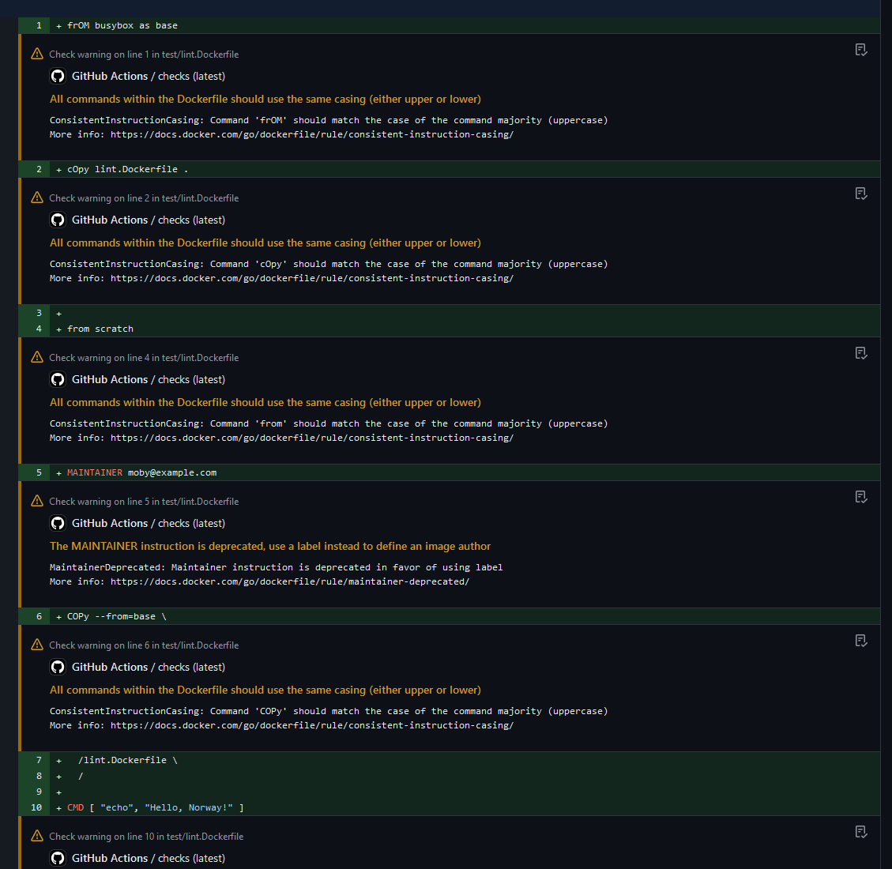

빌드 체크는 Dockerfile 1.8에 도입된 기능입니다. 이를 통해 빌드 구성을 검증하고 빌드를 실행하기 전에 일련의 검사를 수행할 수 있습니다. 이는 마치 Dockerfile과 빌드 옵션을 위한 고급 문법 검사 도구처럼 작동하며, 실제 빌드 없이 시뮬레이션해볼 수 있는 테스트 모드라고 생각하시면 됩니다.

사용 가능한 체크 목록과 각 체크에 대한 설명은 [빌드 체크 참조](/reference/build-checks/)에서 확인할 수 있습니다.

## 빌드 체크 작동 방식 {#how-build-checks-work}

일반적으로 빌드를 실행할 때 Docker는 Dockerfile 및 지정된 빌드 옵션에 따라 빌드 단계를 실행합니다. 빌드 체크를 사용하면 빌드 단계를 실행하는 대신 Docker가 제공한 Dockerfile 및 옵션을 확인하고 감지된 문제를 보고합니다.

빌드 체크는 다음과 같은 경우 유용합니다:

- 빌드를 실행하기 전에 Dockerfile 및 빌드 옵션을 검증합니다.
- Dockerfile 및 빌드 옵션이 최신 모범 사례와 일치하는지 확인합니다.
- Dockerfile 및 빌드 옵션에서 잠재적인 문제나 안티 패턴을 식별합니다.

## 빌드와 함께 체크 실행 {#build-with-checks}

빌드 체크는 다음에서 지원됩니다:

- Buildx 버전 0.15.0 이상
- [docker/build-push-action](https://github.com/docker/build-push-action) 버전 6.6.0 이상
- [docker/bake-action](https://github.com/docker/bake-action) 버전 5.6.0 이상

빌드를 실행하면 기본적으로 체크가 실행되며, 빌드 출력에 위반 사항이 표시됩니다. 예를 들어, 다음 명령은 이미지를 빌드하고 체크를 실행합니다:

```bash
$ docker build .
[+] Building 3.5s (11/11) FINISHED
...

1 warning found (use --debug to expand):
  - Lint Rule 'JSONArgsRecommended': JSON arguments recommended for CMD to prevent unintended behavior related to OS signals (line 7)

```

이 예에서 빌드는 성공적으로 실행되었지만, `CMD` 명령어는 JSON 배열 구문을 사용해야 한다는 [JSONArgsRecommended](/reference/build-checks/json-args-recommended/) 경고가 보고되었습니다.

GitHub Actions를 사용하면 체크가 풀 리퀘스트의 diff 보기에서 표시됩니다.

```yaml
name: Build and push Docker images
on:
  push:

jobs:
  build:
    runs-on: ubuntu-latest
    steps:
      - name: Build and push
        uses: docker/build-push-action@v6.6.0
```



### 더 자세한 출력 {#more-verbose-output}

일반 `docker build`의 체크 경고는 규칙 이름, 메시지 및 Dockerfile에서 문제가 발생한 줄 번호를 포함하는 간결한 메시지를 표시합니다. 체크에 대한 자세한 정보를 보려면 `--debug` 플래그를 사용할 수 있습니다. 예를 들어:

```bash
$ docker --debug build .
[+] Building 3.5s (11/11) FINISHED
...

 1 warning found:
 - JSONArgsRecommended: JSON arguments recommended for CMD to prevent unintended behavior related to OS signals (line 4)
JSON arguments recommended for ENTRYPOINT/CMD to prevent unintended behavior related to OS signals
More info: https://docs.docker.com/go/dockerfile/rule/json-args-recommended/
Dockerfile:4
--------------------
   2 |
   3 |     FROM alpine
   4 | >>> CMD echo "Hello, world!"
   5 |
--------------------

```

`--debug` 플래그를 사용하면 출력에 체크에 대한 문서 링크와 문제가 발생한 Dockerfile의 코드 조각이 포함됩니다.

## 빌드 없이 체크 실행 {#check-a-build-without-building}

실제로 빌드하지 않고 빌드 체크를 실행하려면 일반적으로 사용하는 `docker build` 명령에 `--check` 플래그를 추가하면 됩니다. 예를 들어:

```bash
$ docker build --check .
```

이 명령은 빌드 단계를 실행하는 대신 체크만 실행하고 발견된 문제를 보고합니다. 문제가 있는 경우 출력에 보고됩니다. 예를 들어:

```text {title="Output with --check"}
[+] Building 1.5s (5/5) FINISHED
=> [internal] connecting to local controller
=> [internal] load build definition from Dockerfile
=> => transferring dockerfile: 253B
=> [internal] load metadata for docker.io/library/node:22
=> [auth] library/node:pull token for registry-1.docker.io
=> [internal] load .dockerignore
=> => transferring context: 50B
JSONArgsRecommended - https://docs.docker.com/go/dockerfile/rule/json-args-recommended/
JSON arguments recommended for ENTRYPOINT/CMD to prevent unintended behavior related to OS signals
Dockerfile:7
--------------------
5 |
6 |     COPY index.js .
7 | >>> CMD node index.js
8 |
--------------------
```

이 `--check` 출력은 체크에 대한 [자세한 메시지](#more-verbose-output)를 보여줍니다.

일반 빌드와 달리, `--check` 플래그를 사용할 때 위반 사항이 보고되면 명령은 비영 제로 상태 코드로 종료됩니다.

## 체크 위반 시 빌드 실패 {#fail-build-on-check-violations}

기본적으로 빌드의 체크 위반은 경고로 보고되며, 종료 코드 0으로 설정됩니다. Dockerfile에 `check=error=true` 지시어를 사용하여 위반 사항이 보고될 때 빌드가 실패하도록 Docker를 구성할 수 있습니다. 이렇게 하면 실제 빌드가 실행되기 전에 빌드 체크가 실행된 후 빌드가 오류로 종료됩니다.

```dockerfile {title=Dockerfile,linenos=true,hl_lines=2}
# syntax=docker/dockerfile:1
# check=error=true

FROM alpine
CMD echo "Hello, world!"
```

`# check=error=true` 지시어가 없으면 이 빌드는 종료 코드 0으로 완료됩니다. 그러나 지시어가 있으면 빌드 체크 위반 결과로 비영 제로 종료 코드가 발생합니다:

```bash
$ docker build .
[+] Building 1.5s (5/5) FINISHED
...

 1 warning found (use --debug to expand):
 - JSONArgsRecommended: JSON arguments recommended for CMD to prevent unintended behavior related to OS signals (line 5)
Dockerfile:1
--------------------
   1 | >>> # syntax=docker/dockerfile:1
   2 |     # check=error=true
   3 |
--------------------
ERROR: lint violation found for rules: JSONArgsRecommended
$ echo $?
1
```

CLI에서 `BUILDKIT_DOCKERFILE_CHECK` 빌드 인수를 전달하여 오류 지시어를 설정할 수도 있습니다:

```bash
$ docker build --check --build-arg "BUILDKIT_DOCKERFILE_CHECK=error=true" .
```

## 체크 건너뛰기 {#skip-checks}

기본적으로 이미지를 빌드할 때 모든 체크가 실행됩니다. 특정 체크를 건너뛰려면 Dockerfile에 `check=skip` 지시어를 사용할 수 있습니다. `skip` 매개변수는 건너뛰려는 체크 ID의 CSV 문자열을 받습니다. 예를 들어:

```dockerfile {title=Dockerfile}
# syntax=docker/dockerfile:1
# check=skip=JSONArgsRecommended,StageNameCasing

FROM alpine AS BASE_STAGE
CMD echo "Hello, world!"
```

이 Dockerfile을 빌드하면 체크 위반이 발생하지 않습니다.

건너뛸 체크 ID의 CSV 문자열을 포함한 `BUILDKIT_DOCKERFILE_CHECK` 빌드 인수를 전달하여 체크를 건너뛸 수도 있습니다. 예를 들어:

```bash
$ docker build --check --build-arg "BUILDKIT_DOCKERFILE_CHECK=skip=JSONArgsRecommended,StageNameCasing" .
```

모든 체크를 건너뛰려면 `skip=all` 매개변수를 사용하십시오:

```dockerfile {title=Dockerfile}
# syntax=docker/dockerfile:1
# check=skip=all
```

## 체크 지시어에 대한 오류 및 건너뛰기 매개변수 결합 {#combine-error-and-skip-parameters-for-check-directives}

특정 체크를 건너뛰고 체크 위반 시 오류를 발생시키려면 `skip` 및 `error` 매개변수를 세미콜론(`;`)으로 구분하여 Dockerfile 또는 빌드 인수에 있는 `check` 지시어에 전달하십시오. 예를 들어:

```dockerfile {title=Dockerfile}
# syntax=docker/dockerfile:1
# check=skip=JSONArgsRecommended,StageNameCasing;error=true
```

```bash {title="Build argument"}
$ docker build --check --build-arg "BUILDKIT_DOCKERFILE_CHECK=skip=JSONArgsRecommended,StageNameCasing;error=true" .
```

## 실험적 체크 {#experimental-checks}

체크가 안정적으로 승격되기 전에 실험적 체크로 제공될 수 있습니다. 실험적 체크는 기본적으로 비활성화되어 있습니다. 사용 가능한 실험적 체크 목록은 [빌드 체크 참조](/reference/build-checks/)를 참조하십시오.

모든 실험적 체크를 활성화하려면 `BUILDKIT_DOCKERFILE_CHECK` 빌드 인수를 `experimental=all`로 설정하십시오:

```bash
$ docker build --check --build-arg "BUILDKIT_DOCKERFILE_CHECK=experimental=all" .
```

Dockerfile에서 `check` 지시어를 사용하여 실험적 체크를 활성화할 수도 있습니다:

```dockerfile {title=Dockerfile}
# syntax=docker/dockerfile:1
# check=experimental=all
```

선택적으로 실험적 체크를 활성화하려면 활성화하려는 체크 ID의 CSV 문자열을 Dockerfile의 `check` 지시어 또는 빌드 인수로 전달할 수 있습니다. 예를 들어:

```dockerfile {title=Dockerfile}
# syntax=docker/dockerfile:1
# check=experimental=JSONArgsRecommended,StageNameCasing
```

`experimental` 지시어는 `skip` 지시어보다 우선합니다. 즉, 실험적 체크는 설정된 `skip` 지시어와 상관없이 실행됩니다. 예를 들어, `skip=all`을 설정하고 실험적 체크를 활성화하면 실험적 체크는 여전히 실행됩니다:

```dockerfile {title=Dockerfile}
# syntax=docker/dockerfile:1
# check=skip=all;experimental=all
```

## 추가 읽을거리 {#further-reading}

빌드 체크 사용에 대한 자세한 내용은 다음을 참조하십시오:

- [빌드 체크 참조](/reference/build-checks/)
- [GitHub Actions를 사용한 빌드 구성 검증](/manuals/build/ci/github-actions/checks.md)
