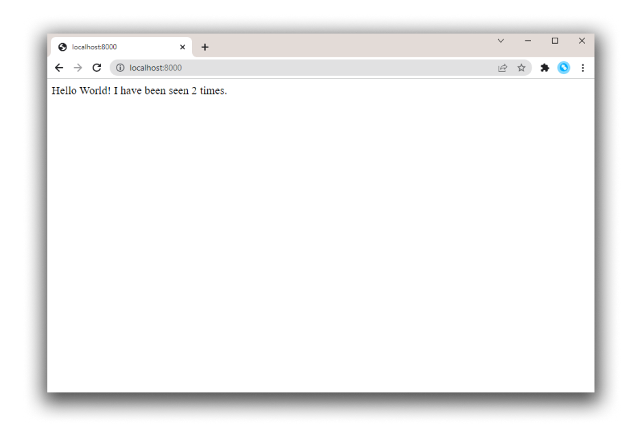

---
description:
  Docker Compose를 사용하여 애플리케이션 종속성을 정의하고 명령을 실험하는 방법에 대한 튜토리얼을 확인하세요.
keywords:
  - 도커 컴포즈 예제
  - 도커 컴포즈 튜토리얼
  - 도커 컴포즈 사용법
  - 도커 컴포즈 실행
  - 도커 컴포즈 실행 방법
  - 도커 컴포즈 이미지 빌드
  - 도커 컴포즈 명령 예제
  - 도커 컴포즈 파일 실행
  - 도커 컴포즈 파일 생성 방법
  - 도커 컴포즈 파일 실행
title: Docker Compose 빠른 시작
linkTitle: Quickstart
weight: 30
---

이 튜토리얼은 기본적인 Python 웹 애플리케이션 개발을 통해 Docker Compose의 기본 개념을 소개하는 것을 목표로 합니다.

Flask 프레임워크를 사용하여 애플리케이션은 Redis에서 히트 카운터를 특징으로 하며, Docker Compose가 웹 개발 시나리오에 어떻게 적용될 수 있는지에 대한 실용적인 예를 제공합니다.

여기서 설명하는 개념은 Python을 잘 모르는 경우에도 이해할 수 있어야 합니다.

이것은 Compose로 할 수 있는 주요 작업을 강조하는 참고용 예제입니다.

## 사전 준비 {#prerequisites}

다음을 확인하세요:

- Docker Compose의 최신 버전 설치
- Docker 개념과 Docker 작동 방식에 대한 기본 이해

## 1단계: 설정 {#step-1-set-up}

1. 프로젝트를 위한 디렉토리를 만듭니다:

   ```bash
   $ mkdir composetest
   $ cd composetest
   ```

2. 프로젝트 디렉토리에 `app.py` 파일을 만들고 다음 코드를 붙여넣습니다:

   ```python
   import time

   import redis
   from flask import Flask

   app = Flask(__name__)
   cache = redis.Redis(host='redis', port=6379)

   def get_hit_count():
       retries = 5
       while True:
           try:
               return cache.incr('hits')
           except redis.exceptions.ConnectionError as exc:
               if retries == 0:
                   raise exc
               retries -= 1
               time.sleep(0.5)

   @app.route('/')
   def hello():
       count = get_hit_count()
       return f'Hello World! I have been seen {count} times.\n'
   ```

   이 예제에서 `redis`는 애플리케이션 네트워크의 redis 컨테이너의 호스트 이름이며 기본 포트 `6379`이 사용됩니다.

   :::note
   `get_hit_count` 함수가 작성된 방식에 주목하세요. 이 기본 재시도 루프는 Redis 서비스가 사용 가능하지 않을 때 여러 번 요청을 시도합니다. 이는 애플리케이션이 온라인 상태가 되는 동안 유용하며, 애플리케이션의 수명 동안 Redis 서비스를 다시 시작해야 할 때도 애플리케이션을 더 탄력적으로 만듭니다. 클러스터에서는 노드 간의 순간적인 연결 끊김을 처리하는 데도 도움이 됩니다.
   :::

3. 프로젝트 디렉토리에 `requirements.txt` 파일을 만들고 다음 코드를 붙여넣습니다:

   ```text
   flask
   redis
   ```

4. `Dockerfile`을 만들고 다음 코드를 붙여넣습니다:

   ```dockerfile
   # syntax=docker/dockerfile:1
   FROM python:3.10-alpine
   WORKDIR /code
   ENV FLASK_APP=app.py
   ENV FLASK_RUN_HOST=0.0.0.0
   RUN apk add --no-cache gcc musl-dev linux-headers
   COPY requirements.txt requirements.txt
   RUN pip install -r requirements.txt
   EXPOSE 5000
   COPY . .
   CMD ["flask", "run", "--debug"]
   ```

   이는 Docker에게 다음을 지시합니다:

   - Python 3.10 이미지로 시작하여 이미지를 빌드합니다.
   - 작업 디렉토리를 `/code`로 설정합니다.
   - `flask` 명령에서 사용되는 환경 변수를 설정합니다.
   - gcc 및 기타 종속성을 설치합니다.
   - `requirements.txt`를 복사하고 Python 종속성을 설치합니다.
   - 컨테이너가 포트 5000을 수신 대기하고 있음을 설명하는 메타데이터를 이미지에 추가합니다.
   - 현재 디렉토리 `.`를 이미지의 작업 디렉토리 `.`에 복사합니다.
   - 컨테이너의 기본 명령을 `flask run --debug`로 설정합니다.

   :::important
   `Dockerfile`에 `.txt`와 같은 파일 확장자가 없는지 확인하세요. 일부 편집기는 이 파일 확장자를 자동으로 추가하여 애플리케이션을 실행할 때 오류가 발생할 수 있습니다.
   :::

   Dockerfile 작성 방법에 대한 자세한 내용은 [Dockerfile 참조](/reference/dockerfile/)를 참조하세요.

## 2단계: Compose 파일에서 서비스 정의 {#step-2-define-services-in-a-compose-file}

Compose는 전체 애플리케이션 스택을 제어하는 것을 단순화하여 서비스, 네트워크 및 볼륨을 단일 이해 가능한 YAML 구성 파일에서 쉽게 관리할 수 있게 합니다.

프로젝트 디렉토리에 `compose.yaml` 파일을 만들고 다음을 붙여넣습니다:

```yaml
services:
  web:
    build: .
    ports:
      - "8000:5000"
  redis:
    image: "redis:alpine"
```

이 Compose 파일은 두 개의 서비스를 정의합니다: `web`과 `redis`.

`web` 서비스는 현재 디렉토리의 `Dockerfile`에서 빌드된 이미지를 사용합니다.
그런 다음 컨테이너와 호스트 머신을 노출된 포트 `8000`에 바인딩합니다. 이 예제 서비스는 Flask 웹 서버의 기본 포트 `5000`을 사용합니다.

`redis` 서비스는 Docker Hub 레지스트리에서 가져온 공개 [Redis](https://registry.hub.docker.com/_/redis/) 이미지를 사용합니다.

`compose.yaml` 파일에 대한 자세한 내용은 [Compose 작동 방식](compose-application-model.md)을 참조하세요.

## 3단계: Compose로 앱 빌드 및 실행 {#step-3-build-and-run-your-app-with-compose}

단일 명령으로 구성 파일에서 모든 서비스를 생성하고 시작할 수 있습니다.

1. 프로젝트 디렉토리에서 `docker compose up` 명령을 실행하여 애플리케이션을 시작합니다.

   ```bash
   $ docker compose up

   Creating network "composetest_default" with the default driver
   Creating composetest_web_1 ...
   Creating composetest_redis_1 ...
   Creating composetest_web_1
   Creating composetest_redis_1 ... done
   Attaching to composetest_web_1, composetest_redis_1
   web_1    |  * Running on http://0.0.0.0:5000/ (Press CTRL+C to quit)
   redis_1  | 1:C 17 Aug 22:11:10.480 # oO0OoO0OoO0Oo Redis is starting oO0OoO0OoO0Oo
   redis_1  | 1:C 17 Aug 22:11:10.480 # Redis version=4.0.1, bits=64, commit=00000000, modified=0, pid=1, just started
   redis_1  | 1:C 17 Aug 22:11:10.480 # Warning: no config file specified, using the default config. In order to specify a config file use redis-server /path/to/redis.conf
   web_1    |  * Restarting with stat
   redis_1  | 1:M 17 Aug 22:11:10.483 * Running mode=standalone, port=6379.
   redis_1  | 1:M 17 Aug 22:11:10.483 # WARNING: The TCP backlog setting of 511 cannot be enforced because /proc/sys/net/core/somaxconn is set to the lower value of 128.
   web_1    |  * Debugger is active!
   redis_1  | 1:M 17 Aug 22:11:10.483 # Server initialized
   redis_1  | 1:M 17 Aug 22:11:10.483 # WARNING you have Transparent Huge Pages (THP) support enabled in your kernel. This will create latency and memory usage issues with Redis. To fix this issue run the command 'echo never > /sys/kernel/mm/transparent_hugepage/enabled' as root, and add it to your /etc/rc.local in order to retain the setting after a reboot. Redis must be restarted after THP is disabled.
   web_1    |  * Debugger PIN: 330-787-903
   redis_1  | 1:M 17 Aug 22:11:10.483 * Ready to accept connections
   ```

   Compose는 Redis 이미지를 가져오고, 코드의 이미지를 빌드하고, 정의한 서비스를 시작합니다. 이 경우 코드는 빌드 시 정적으로 이미지에 복사됩니다.

2. 브라우저에 `http://localhost:8000/`을 입력하여 애플리케이션이 실행 중인지 확인합니다.

   이 주소가 해결되지 않으면 `http://127.0.0.1:8000`을 시도할 수도 있습니다.

   브라우저에서 다음 메시지가 표시되어야 합니다:

   ```text
   Hello World! I have been seen 1 times.
   ```

   

3. 페이지를 새로 고칩니다.

   숫자가 증가해야 합니다.

   ```text
   Hello World! I have been seen 2 times.
   ```

   

4. 다른 터미널 창으로 전환하고 `docker image ls` 명령을 입력하여 로컬 이미지를 나열합니다.

   이 시점에서 이미지를 나열하면 `redis`와 `web`이 반환되어야 합니다.

   ```bash
   $ docker image ls

   REPOSITORY        TAG           IMAGE ID      CREATED        SIZE
   composetest_web   latest        e2c21aa48cc1  4 minutes ago  93.8MB
   python            3.4-alpine    84e6077c7ab6  7 days ago     82.5MB
   redis             alpine        9d8fa9aa0e5b  3 weeks ago    27.5MB
   ```

   `docker inspect <tag or id>` 명령으로 이미지를 검사할 수 있습니다.

5. 애플리케이션을 중지하려면 두 번째 터미널에서 프로젝트 디렉토리 내에서 `docker compose down` 명령을 실행하거나, 애플리케이션을 시작한 원래 터미널에서 `CTRL+C`를 누릅니다.

## 4단계: Compose Watch를 사용하도록 Compose 파일 편집 {#step-4-edit-the-compose-file-to-use-compose-watch}

프로젝트 디렉토리의 `compose.yaml` 파일을 편집하여 `watch`를 사용하여 코드를 편집하고 저장할 때 자동으로 업데이트되는 실행 중인 Compose 서비스를 미리 볼 수 있습니다:

```yaml
services:
  web:
    build: .
    ports:
      - "8000:5000"
    develop:
      watch:
        - action: sync
          path: .
          target: /code
  redis:
    image: "redis:alpine"
```

파일이 변경될 때마다 Compose는 파일을 컨테이너 내부의 `/code` 아래의 해당 위치로 동기화합니다. 복사된 후 번들러는 재시작 없이 실행 중인 애플리케이션을 업데이트합니다.

Compose Watch 작동 방식에 대한 자세한 내용은 [Compose Watch 사용](/manuals/compose/how-tos/file-watch.md)을 참조하세요. 또는 다른 옵션에 대해서는 [컨테이너에서 데이터 관리](/manuals/engine/storage/volumes.md)를 참조하세요.

:::note
이 예제가 작동하려면 `Dockerfile`에 `--debug` 옵션이 추가됩니다. Flask의 `--debug` 옵션은 자동 코드 리로드를 활성화하여 컨테이너를 다시 시작하거나 다시 빌드할 필요 없이 백엔드 API 작업을 가능하게 합니다.
`.py` 파일을 변경한 후 후속 API 호출은 새로운 코드를 사용하지만, 이 작은 예제에서는 브라우저 UI가 자동으로 새로 고쳐지지 않습니다. 대부분의 프론트엔드 개발 서버는 Compose와 함께 작동하는 네이티브 라이브 리로드 지원을 포함합니다.
:::

## 5단계: Compose로 앱 다시 빌드 및 실행 {#step-5-re-build-and-run-the-app-with-compose}

프로젝트 디렉토리에서 `docker compose watch` 또는 `docker compose up --watch` 명령을 입력하여 앱을 빌드하고 실행하며 파일 감시 모드를 시작합니다.

```bash
$ docker compose watch
[+] Running 2/2
 ✔ Container docs-redis-1 Created                                                                                                                                                                                                        0.0s
 ✔ Container docs-web-1    Recreated                                                                                                                                                                                                      0.1s
Attaching to redis-1, web-1
         ⦿ watch enabled
...
```

웹 브라우저에서 `Hello World` 메시지를 다시 확인하고 새로 고쳐서 카운트가 증가하는지 확인합니다.

## 6단계: 애플리케이션 업데이트 {#step-6-update-the-application}

Compose Watch를 작동시키려면:

1. `app.py`의 인사말을 변경하고 저장합니다. 예를 들어, `Hello World!` 메시지를 `Hello from Docker!`로 변경합니다:

   ```python
   return f'Hello from Docker! I have been seen {count} times.\n'
   ```

2. 브라우저에서 앱을 새로 고칩니다. 인사말이 업데이트되고 카운터가 계속 증가해야 합니다.

   

3. 완료되면 `docker compose down` 명령을 실행합니다.

## 7단계: 서비스를 분리 {#step-7-split-up-your-services}

여러 Compose 파일을 사용하면 다양한 환경이나 워크플로에 맞게 Compose 애플리케이션을 사용자 정의할 수 있습니다. 이는 여러 팀이 소유하는 수십 개의 컨테이너를 사용하는 대규모 애플리케이션에 유용합니다.

1. 프로젝트 폴더에 `infra.yaml`이라는 새 Compose 파일을 만듭니다.

2. `compose.yaml` 파일에서 Redis 서비스를 잘라내어 새 `infra.yaml` 파일에 붙여넣습니다. 파일 상단에 `services` 최상위 속성을 추가해야 합니다. `infra.yaml` 파일은 다음과 같아야 합니다:

   ```yaml
   services:
     redis:
       image: "redis:alpine"
   ```

3. `compose.yaml` 파일에 `include` 최상위 속성과 `infra.yaml` 파일 경로를 추가합니다.

   ```yaml
   include:
     - infra.yaml
   services:
     web:
       build: .
       ports:
         - "8000:5000"
       develop:
         watch:
           - action: sync
             path: .
             target: /code
   ```

4. 업데이트된 Compose 파일로 앱을 빌드하고 실행하려면 `docker compose up` 명령을 실행합니다. 브라우저에서 `Hello world` 메시지를 확인할 수 있어야 합니다.

이것은 단순화된 예제이지만, `include`의 기본 원칙과 복잡한 애플리케이션을 하위 Compose 파일로 모듈화하는 방법을 보여줍니다. `include` 및 여러 Compose 파일 작업에 대한 자세한 내용은 [여러 Compose 파일 작업](/manuals/compose/how-tos/multiple-compose-files/_index.md)을 참조하세요.

## 8단계: 다른 명령 테스트 {#step-8-experiment-with-some-other-commands}

- 서비스를 백그라운드에서 실행하려면 `docker compose up`에 `-d` 플래그(“분리” 모드)를 전달하고 `docker compose ps`를 사용하여 현재 실행 중인 내용을 확인할 수 있습니다:

  ```bash
  $ docker compose up -d

  Starting composetest_redis_1...
  Starting composetest_web_1...

  $ docker compose ps

         Name                      Command               State           Ports
  -------------------------------------------------------------------------------------
  composetest_redis_1   docker-entrypoint.sh redis ...   Up      6379/tcp
  composetest_web_1     flask run                        Up      0.0.0.0:8000->5000/tcp
  ```

- 사용 가능한 다른 명령을 보려면 `docker compose --help` 명령을 실행하세요.

- `docker compose up -d`로 Compose를 시작한 경우, 작업이 끝나면 서비스를 중지하세요:

  ```bash
  $ docker compose stop
  ```

- 컨테이너를 완전히 제거하려면 `docker compose down` 명령을 사용하여 모든 것을 내릴 수 있습니다.

## 다음 단계 {#where-to-go-next}

- [Compose 샘플 앱 시도](https://github.com/docker/awesome-compose)
- [Compose 명령 전체 목록 탐색](/reference/cli/docker/compose.md)
- [Compose 파일 참조 탐색](/reference/compose-file/_index.md)
- [LinkedIn Learning의 Learning Docker Compose 비디오 확인](https://www.linkedin.com/learning/learning-docker-compose/)
